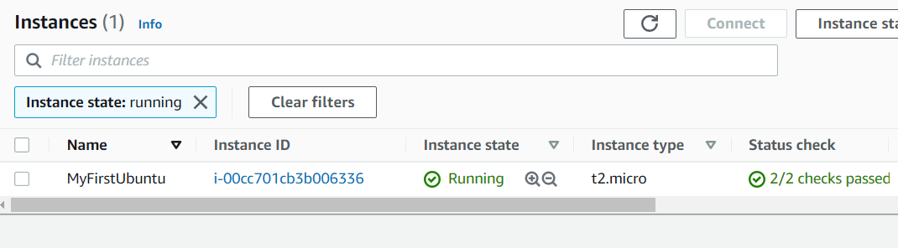
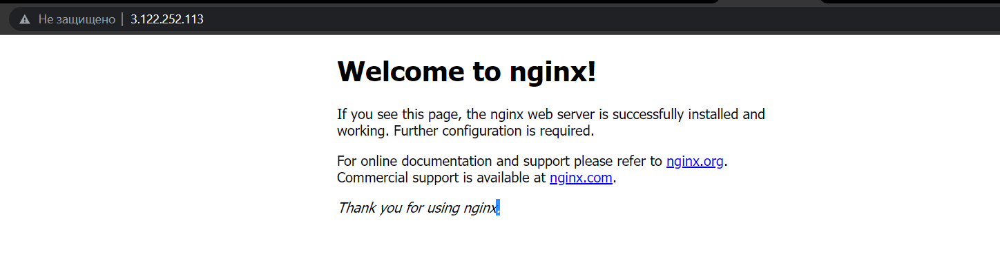

# Первая виртуальная машина ubuntu с ngnix #
## Инструкция по установке: ##

## Вывод команды terraform plan ##
```
Terraform used the selected providers to generate the following execution plan. Resource actions are indicated with the
following symbols:
  + create

Terraform will perform the following actions:

  # aws_instance.ubuntu-vm will be created
  + resource "aws_instance" "ubuntu-vm" {
      + ami                                  = "ami-0a49b025fffbbdac6"
      + arn                                  = (known after apply)
      + associate_public_ip_address          = (known after apply)
      + availability_zone                    = (known after apply)
      + cpu_core_count                       = (known after apply)
      + cpu_threads_per_core                 = (known after apply)
      + disable_api_termination              = (known after apply)
      + ebs_optimized                        = (known after apply)
      + get_password_data                    = false
      + host_id                              = (known after apply)
      + id                                   = (known after apply)
      + instance_initiated_shutdown_behavior = (known after apply)
      + instance_state                       = (known after apply)
      + instance_type                        = "t2.micro"
      + ipv6_address_count                   = (known after apply)
      + ipv6_addresses                       = (known after apply)
      + key_name                             = "key1"
      + monitoring                           = (known after apply)
      + outpost_arn                          = (known after apply)
      + password_data                        = (known after apply)
      + placement_group                      = (known after apply)
      + placement_partition_number           = (known after apply)
      + primary_network_interface_id         = (known after apply)
      + private_dns                          = (known after apply)
      + private_ip                           = (known after apply)
      + public_dns                           = (known after apply)
      + public_ip                            = (known after apply)
      + secondary_private_ips                = (known after apply)
      + security_groups                      = [
          + "allow-all",
        ]
      + source_dest_check                    = true
      + subnet_id                            = (known after apply)
      + tags                                 = {
          + "Name" = "MyFirstUbuntu"
        }
      + tags_all                             = {
          + "Name" = "MyFirstUbuntu"
        }
      + tenancy                              = (known after apply)
      + user_data                            = (known after apply)
      + user_data_base64                     = (known after apply)
      + vpc_security_group_ids               = (known after apply)

      + capacity_reservation_specification {
          + capacity_reservation_preference = (known after apply)

          + capacity_reservation_target {
              + capacity_reservation_id = (known after apply)
            }
        }

      + ebs_block_device {
          + delete_on_termination = (known after apply)
          + device_name           = (known after apply)
          + encrypted             = (known after apply)
          + iops                  = (known after apply)
          + kms_key_id            = (known after apply)
          + snapshot_id           = (known after apply)
          + tags                  = (known after apply)
          + throughput            = (known after apply)
          + volume_id             = (known after apply)
          + volume_size           = (known after apply)
          + volume_type           = (known after apply)
        }

      + enclave_options {
          + enabled = (known after apply)
        }

      + ephemeral_block_device {
          + device_name  = (known after apply)
          + no_device    = (known after apply)
          + virtual_name = (known after apply)
        }

      + metadata_options {
          + http_endpoint               = (known after apply)
          + http_put_response_hop_limit = (known after apply)
          + http_tokens                 = (known after apply)
        }

      + network_interface {
          + delete_on_termination = (known after apply)
          + device_index          = (known after apply)
          + network_interface_id  = (known after apply)
        }

      + root_block_device {
          + delete_on_termination = (known after apply)
          + device_name           = (known after apply)
          + encrypted             = (known after apply)
          + iops                  = (known after apply)
          + kms_key_id            = (known after apply)
          + tags                  = (known after apply)
          + throughput            = (known after apply)
          + volume_id             = (known after apply)
          + volume_size           = (known after apply)
          + volume_type           = (known after apply)
        }
    }

  # aws_key_pair.kp will be created
  + resource "aws_key_pair" "kp" {
      + arn         = (known after apply)
      + fingerprint = (known after apply)
      + id          = (known after apply)
      + key_name    = "key1"
      + key_pair_id = (known after apply)
      + public_key  = (known after apply)
      + tags_all    = (known after apply)
    }

  # aws_security_group.ubuntu-vm-security will be created
  + resource "aws_security_group" "ubuntu-vm-security" {
      + arn                    = (known after apply)
      + description            = "Managed by Terraform"
      + egress                 = [
          + {
              + cidr_blocks      = [
                  + "0.0.0.0/0",
                ]
              + description      = ""
              + from_port        = 0
              + ipv6_cidr_blocks = []
              + prefix_list_ids  = []
              + protocol         = "-1"
              + security_groups  = []
              + self             = false
              + to_port          = 0
            },
        ]
      + id                     = (known after apply)
      + ingress                = [
          + {
              + cidr_blocks      = [
                  + "0.0.0.0/0",
                ]
              + description      = ""
              + from_port        = 22
              + ipv6_cidr_blocks = []
              + prefix_list_ids  = []
              + protocol         = "tcp"
              + security_groups  = []
              + self             = false
              + to_port          = 22
            },
          + {
              + cidr_blocks      = [
                  + "0.0.0.0/0",
                ]
              + description      = ""
              + from_port        = 443
              + ipv6_cidr_blocks = []
              + prefix_list_ids  = []
              + protocol         = "tcp"
              + security_groups  = []
              + self             = false
              + to_port          = 443
            },
          + {
              + cidr_blocks      = [
                  + "0.0.0.0/0",
                ]
              + description      = ""
              + from_port        = 80
              + ipv6_cidr_blocks = []
              + prefix_list_ids  = []
              + protocol         = "tcp"
              + security_groups  = []
              + self             = false
              + to_port          = 80
            },
        ]
      + name                   = "allow-all"
      + name_prefix            = (known after apply)
      + owner_id               = (known after apply)
      + revoke_rules_on_delete = false
      + tags_all               = (known after apply)
      + vpc_id                 = (known after apply)
    }

  # tls_private_key.pk will be created
  + resource "tls_private_key" "pk" {
      + algorithm                  = "RSA"
      + ecdsa_curve                = "P224"
      + id                         = (known after apply)
      + private_key_pem            = (sensitive value)
      + public_key_fingerprint_md5 = (known after apply)
      + public_key_openssh         = (known after apply)
      + public_key_pem             = (known after apply)
      + rsa_bits                   = 4096
    }

Plan: 4 to add, 0 to change, 0 to destroy.

───────────────────────────────────────────────────────────────────────────────────────────────────────────────────────

Note: You didn't use the -out option to save this plan, so Terraform can't guarantee to take exactly these actions if
you run "terraform apply" now.
```

## Вывод команды terraform apply ##
```
Terraform used the selected providers to generate the following execution plan. Resource actions are indicated with the
following symbols:
  + create

Terraform will perform the following actions:

  # aws_instance.ubuntu-vm will be created
  + resource "aws_instance" "ubuntu-vm" {
      + ami                                  = "ami-0a49b025fffbbdac6"
      + arn                                  = (known after apply)
      + associate_public_ip_address          = (known after apply)
      + availability_zone                    = (known after apply)
      + cpu_core_count                       = (known after apply)
      + cpu_threads_per_core                 = (known after apply)
      + disable_api_termination              = (known after apply)
      + ebs_optimized                        = (known after apply)
      + get_password_data                    = false
      + host_id                              = (known after apply)
      + id                                   = (known after apply)
      + instance_initiated_shutdown_behavior = (known after apply)
      + instance_state                       = (known after apply)
      + instance_type                        = "t2.micro"
      + ipv6_address_count                   = (known after apply)
      + ipv6_addresses                       = (known after apply)
      + key_name                             = "key1"
      + monitoring                           = (known after apply)
      + outpost_arn                          = (known after apply)
      + password_data                        = (known after apply)
      + placement_group                      = (known after apply)
      + placement_partition_number           = (known after apply)
      + primary_network_interface_id         = (known after apply)
      + private_dns                          = (known after apply)
      + private_ip                           = (known after apply)
      + public_dns                           = (known after apply)
      + public_ip                            = (known after apply)
      + secondary_private_ips                = (known after apply)
      + security_groups                      = [
          + "allow-all",
        ]
      + source_dest_check                    = true
      + subnet_id                            = (known after apply)
      + tags                                 = {
          + "Name" = "MyFirstUbuntu"
        }
      + tags_all                             = {
          + "Name" = "MyFirstUbuntu"
        }
      + tenancy                              = (known after apply)
      + user_data                            = (known after apply)
      + user_data_base64                     = (known after apply)
      + vpc_security_group_ids               = (known after apply)

      + capacity_reservation_specification {
          + capacity_reservation_preference = (known after apply)

          + capacity_reservation_target {
              + capacity_reservation_id = (known after apply)
            }
        }

      + ebs_block_device {
          + delete_on_termination = (known after apply)
          + device_name           = (known after apply)
          + encrypted             = (known after apply)
          + iops                  = (known after apply)
          + kms_key_id            = (known after apply)
          + snapshot_id           = (known after apply)
          + tags                  = (known after apply)
          + throughput            = (known after apply)
          + volume_id             = (known after apply)
          + volume_size           = (known after apply)
          + volume_type           = (known after apply)
        }

      + enclave_options {
          + enabled = (known after apply)
        }

      + ephemeral_block_device {
          + device_name  = (known after apply)
          + no_device    = (known after apply)
          + virtual_name = (known after apply)
        }

      + metadata_options {
          + http_endpoint               = (known after apply)
          + http_put_response_hop_limit = (known after apply)
          + http_tokens                 = (known after apply)
        }

      + network_interface {
          + delete_on_termination = (known after apply)
          + device_index          = (known after apply)
          + network_interface_id  = (known after apply)
        }

      + root_block_device {
          + delete_on_termination = (known after apply)
          + device_name           = (known after apply)
          + encrypted             = (known after apply)
          + iops                  = (known after apply)
          + kms_key_id            = (known after apply)
          + tags                  = (known after apply)
          + throughput            = (known after apply)
          + volume_id             = (known after apply)
          + volume_size           = (known after apply)
          + volume_type           = (known after apply)
        }
    }

  # aws_key_pair.kp will be created
  + resource "aws_key_pair" "kp" {
      + arn         = (known after apply)
      + fingerprint = (known after apply)
      + id          = (known after apply)
      + key_name    = "key1"
      + key_pair_id = (known after apply)
      + public_key  = (known after apply)
      + tags_all    = (known after apply)
    }

  # aws_security_group.ubuntu-vm-security will be created
  + resource "aws_security_group" "ubuntu-vm-security" {
      + arn                    = (known after apply)
      + description            = "Managed by Terraform"
      + egress                 = [
          + {
              + cidr_blocks      = [
                  + "0.0.0.0/0",
                ]
              + description      = ""
              + from_port        = 0
              + ipv6_cidr_blocks = []
              + prefix_list_ids  = []
              + protocol         = "-1"
              + security_groups  = []
              + self             = false
              + to_port          = 0
            },
        ]
      + id                     = (known after apply)
      + ingress                = [
          + {
              + cidr_blocks      = [
                  + "0.0.0.0/0",
                ]
              + description      = ""
              + from_port        = 22
              + ipv6_cidr_blocks = []
              + prefix_list_ids  = []
              + protocol         = "tcp"
              + security_groups  = []
              + self             = false
              + to_port          = 22
            },
          + {
              + cidr_blocks      = [
                  + "0.0.0.0/0",
                ]
              + description      = ""
              + from_port        = 443
              + ipv6_cidr_blocks = []
              + prefix_list_ids  = []
              + protocol         = "tcp"
              + security_groups  = []
              + self             = false
              + to_port          = 443
            },
          + {
              + cidr_blocks      = [
                  + "0.0.0.0/0",
                ]
              + description      = ""
              + from_port        = 80
              + ipv6_cidr_blocks = []
              + prefix_list_ids  = []
              + protocol         = "tcp"
              + security_groups  = []
              + self             = false
              + to_port          = 80
            },
        ]
      + name                   = "allow-all"
      + name_prefix            = (known after apply)
      + owner_id               = (known after apply)
      + revoke_rules_on_delete = false
      + tags_all               = (known after apply)
      + vpc_id                 = (known after apply)
    }

  # tls_private_key.pk will be created
  + resource "tls_private_key" "pk" {
      + algorithm                  = "RSA"
      + ecdsa_curve                = "P224"
      + id                         = (known after apply)
      + private_key_pem            = (sensitive value)
      + public_key_fingerprint_md5 = (known after apply)
      + public_key_openssh         = (known after apply)
      + public_key_pem             = (known after apply)
      + rsa_bits                   = 4096
    }

Plan: 4 to add, 0 to change, 0 to destroy.

Do you want to perform these actions?
  Terraform will perform the actions described above.
  Only 'yes' will be accepted to approve.

  Enter a value: yes

tls_private_key.pk: Creating...
tls_private_key.pk: Creation complete after 1s [id=95e7acb8be65b202a41d5d48d39f0696bc8f1906]
aws_key_pair.kp: Creating...
aws_security_group.ubuntu-vm-security: Creating...
aws_key_pair.kp: Provisioning with 'local-exec'...
aws_key_pair.kp (local-exec): (output suppressed due to sensitive value in config)
aws_key_pair.kp: Creation complete after 1s [id=key1]
aws_instance.ubuntu-vm: Creating...
aws_security_group.ubuntu-vm-security: Creation complete after 3s [id=sg-0b10272342d2f1f66]
aws_instance.ubuntu-vm: Still creating... [10s elapsed]
aws_instance.ubuntu-vm: Still creating... [20s elapsed]
aws_instance.ubuntu-vm: Still creating... [30s elapsed]
aws_instance.ubuntu-vm: Provisioning with 'remote-exec'...
aws_instance.ubuntu-vm (remote-exec): Connecting to remote host via SSH...
aws_instance.ubuntu-vm (remote-exec):   Host: 3.122.252.113
aws_instance.ubuntu-vm (remote-exec):   User: ubuntu
aws_instance.ubuntu-vm (remote-exec):   Password: false
aws_instance.ubuntu-vm (remote-exec):   Private key: true
aws_instance.ubuntu-vm (remote-exec):   Certificate: false
aws_instance.ubuntu-vm (remote-exec):   SSH Agent: false
aws_instance.ubuntu-vm (remote-exec):   Checking Host Key: false
aws_instance.ubuntu-vm (remote-exec):   Target Platform: unix
aws_instance.ubuntu-vm (remote-exec): Connecting to remote host via SSH...
aws_instance.ubuntu-vm (remote-exec):   Host: 3.122.252.113
aws_instance.ubuntu-vm (remote-exec):   User: ubuntu
aws_instance.ubuntu-vm (remote-exec):   Password: false
aws_instance.ubuntu-vm (remote-exec):   Private key: true
aws_instance.ubuntu-vm (remote-exec):   Certificate: false
aws_instance.ubuntu-vm (remote-exec):   SSH Agent: false
aws_instance.ubuntu-vm (remote-exec):   Checking Host Key: false
aws_instance.ubuntu-vm (remote-exec):   Target Platform: unix
aws_instance.ubuntu-vm (remote-exec): Connecting to remote host via SSH...
aws_instance.ubuntu-vm (remote-exec):   Host: 3.122.252.113
aws_instance.ubuntu-vm (remote-exec):   User: ubuntu
aws_instance.ubuntu-vm (remote-exec):   Password: false
aws_instance.ubuntu-vm (remote-exec):   Private key: true
aws_instance.ubuntu-vm (remote-exec):   Certificate: false
aws_instance.ubuntu-vm (remote-exec):   SSH Agent: false
aws_instance.ubuntu-vm (remote-exec):   Checking Host Key: false
aws_instance.ubuntu-vm (remote-exec):   Target Platform: unix
aws_instance.ubuntu-vm (remote-exec): Connected!
aws_instance.ubuntu-vm: Still creating... [40s elapsed]
aws_instance.ubuntu-vm (remote-exec):
aws_instance.ubuntu-vm (remote-exec): 0% [Working]
aws_instance.ubuntu-vm (remote-exec): Hit:1 http://archive.ubuntu.com/ubuntu focal InRelease
aws_instance.ubuntu-vm (remote-exec):
aws_instance.ubuntu-vm (remote-exec): 0% [Connecting to security.ubuntu.com (
aws_instance.ubuntu-vm (remote-exec): Get:2 http://archive.ubuntu.com/ubuntu focal-updates InRelease [114 kB]
aws_instance.ubuntu-vm (remote-exec):
aws_instance.ubuntu-vm (remote-exec): 0% [2 InRelease 14.2 kB/114 kB 12%] [Co
aws_instance.ubuntu-vm (remote-exec): 0% [Waiting for headers] [Waiting for h
aws_instance.ubuntu-vm (remote-exec): Get:3 http://archive.ubuntu.com/ubuntu focal-backports InRelease [101 kB]
aws_instance.ubuntu-vm (remote-exec):
aws_instance.ubuntu-vm (remote-exec): 0% [3 InRelease 30.1 kB/101 kB 30%] [Wa
aws_instance.ubuntu-vm (remote-exec): 0% [Waiting for headers]
aws_instance.ubuntu-vm (remote-exec): Get:4 http://security.ubuntu.com/ubuntu focal-security InRelease [114 kB]
aws_instance.ubuntu-vm (remote-exec):
aws_instance.ubuntu-vm (remote-exec): 0% [4 InRelease 14.2 kB/114 kB 12%]
aws_instance.ubuntu-vm (remote-exec): 0% [4 InRelease 14.2 kB/114 kB 12%]
aws_instance.ubuntu-vm (remote-exec): Get:5 http://archive.ubuntu.com/ubuntu focal/universe amd64 Packages [8628 kB]
aws_instance.ubuntu-vm (remote-exec):
aws_instance.ubuntu-vm (remote-exec): 0% [5 Packages 17.2 kB/8628 kB 0%] [4 I
aws_instance.ubuntu-vm (remote-exec):
aws_instance.ubuntu-vm (remote-exec): 0% [5 Packages 8628 kB/8628 kB 100%]
aws_instance.ubuntu-vm (remote-exec): 0% [Working]
aws_instance.ubuntu-vm (remote-exec): 0% [5 Packages store 0 B] [Waiting for
aws_instance.ubuntu-vm (remote-exec): Get:6 http://archive.ubuntu.com/ubuntu focal/universe Translation-en [5124 kB]
aws_instance.ubuntu-vm (remote-exec):
aws_instance.ubuntu-vm (remote-exec): 0% [5 Packages store 0 B] [6 Translatio
aws_instance.ubuntu-vm (remote-exec):
aws_instance.ubuntu-vm (remote-exec): 0% [5 Packages store 0 B] [6 Translatio
aws_instance.ubuntu-vm (remote-exec): Get:7 http://archive.ubuntu.com/ubuntu focal/universe amd64 c-n-f Metadata [265 kB]
aws_instance.ubuntu-vm (remote-exec):
aws_instance.ubuntu-vm (remote-exec): 0% [5 Packages store 0 B] [Waiting for
aws_instance.ubuntu-vm (remote-exec): Get:8 http://archive.ubuntu.com/ubuntu focal/multiverse amd64 Packages [144 kB]
aws_instance.ubuntu-vm (remote-exec):
aws_instance.ubuntu-vm (remote-exec): 0% [5 Packages store 0 B] [8 Packages 0
aws_instance.ubuntu-vm (remote-exec): 0% [5 Packages store 0 B]
aws_instance.ubuntu-vm (remote-exec): Get:9 http://archive.ubuntu.com/ubuntu focal/multiverse Translation-en [104 kB]
aws_instance.ubuntu-vm (remote-exec):
aws_instance.ubuntu-vm (remote-exec): 0% [5 Packages store 0 B] [9 Translatio
aws_instance.ubuntu-vm (remote-exec): 0% [5 Packages store 0 B]
aws_instance.ubuntu-vm (remote-exec): Get:10 http://archive.ubuntu.com/ubuntu focal/multiverse amd64 c-n-f Metadata [9136 B]
aws_instance.ubuntu-vm (remote-exec):
aws_instance.ubuntu-vm (remote-exec): 0% [5 Packages store 0 B] [10 Commands-
aws_instance.ubuntu-vm (remote-exec): 0% [5 Packages store 0 B]
aws_instance.ubuntu-vm (remote-exec): Get:11 http://archive.ubuntu.com/ubuntu focal-updates/main amd64 Packages [1302 kB]
aws_instance.ubuntu-vm (remote-exec):
aws_instance.ubuntu-vm (remote-exec): 0% [5 Packages store 0 B] [11 Packages
aws_instance.ubuntu-vm (remote-exec): 0% [5 Packages store 0 B]
aws_instance.ubuntu-vm (remote-exec): Get:12 http://archive.ubuntu.com/ubuntu focal-updates/main Translation-en [270 kB]
aws_instance.ubuntu-vm (remote-exec):
aws_instance.ubuntu-vm (remote-exec): 0% [5 Packages store 0 B] [12 Translati
aws_instance.ubuntu-vm (remote-exec): Get:13 http://archive.ubuntu.com/ubuntu focal-updates/main amd64 c-n-f Metadata [14.4 kB]
aws_instance.ubuntu-vm (remote-exec): Get:14 http://archive.ubuntu.com/ubuntu focal-updates/restricted amd64 Packages [524 kB]
aws_instance.ubuntu-vm (remote-exec):
aws_instance.ubuntu-vm (remote-exec): 0% [5 Packages store 0 B] [14 Packages
aws_instance.ubuntu-vm (remote-exec): 0% [5 Packages store 0 B]
aws_instance.ubuntu-vm (remote-exec): Get:15 http://archive.ubuntu.com/ubuntu focal-updates/restricted Translation-en [75.0 kB]
aws_instance.ubuntu-vm (remote-exec):
aws_instance.ubuntu-vm (remote-exec): 0% [5 Packages store 0 B] [15 Translati
aws_instance.ubuntu-vm (remote-exec): 0% [5 Packages store 0 B]
aws_instance.ubuntu-vm (remote-exec): Get:16 http://archive.ubuntu.com/ubuntu focal-updates/universe amd64 Packages [867 kB]
aws_instance.ubuntu-vm (remote-exec):
aws_instance.ubuntu-vm (remote-exec): 0% [5 Packages store 0 B] [16 Packages
aws_instance.ubuntu-vm (remote-exec): 0% [5 Packages store 0 B]
aws_instance.ubuntu-vm (remote-exec): Get:17 http://archive.ubuntu.com/ubuntu focal-updates/universe Translation-en [187 kB]
aws_instance.ubuntu-vm (remote-exec):
aws_instance.ubuntu-vm (remote-exec): 0% [5 Packages store 0 B] [17 Translati
aws_instance.ubuntu-vm (remote-exec): 0% [5 Packages store 0 B]
aws_instance.ubuntu-vm (remote-exec): Get:18 http://archive.ubuntu.com/ubuntu focal-updates/universe amd64 c-n-f Metadata [19.4 kB]
aws_instance.ubuntu-vm (remote-exec):
aws_instance.ubuntu-vm (remote-exec): 0% [5 Packages store 0 B] [18 Commands-
aws_instance.ubuntu-vm (remote-exec): 0% [5 Packages store 0 B]
aws_instance.ubuntu-vm (remote-exec): Get:19 http://archive.ubuntu.com/ubuntu focal-updates/multiverse amd64 Packages [24.6 kB]
aws_instance.ubuntu-vm (remote-exec):
aws_instance.ubuntu-vm (remote-exec): 0% [5 Packages store 0 B] [19 Packages
aws_instance.ubuntu-vm (remote-exec): 0% [5 Packages store 0 B]
aws_instance.ubuntu-vm (remote-exec): Get:20 http://archive.ubuntu.com/ubuntu focal-updates/multiverse Translation-en [6856 B]
aws_instance.ubuntu-vm (remote-exec):
aws_instance.ubuntu-vm (remote-exec): 0% [5 Packages store 0 B] [20 Translati
aws_instance.ubuntu-vm (remote-exec): 0% [5 Packages store 0 B]
aws_instance.ubuntu-vm (remote-exec): Get:21 http://archive.ubuntu.com/ubuntu focal-updates/multiverse amd64 c-n-f Metadata [620 B]
aws_instance.ubuntu-vm (remote-exec):
aws_instance.ubuntu-vm (remote-exec): 0% [5 Packages store 0 B] [21 Commands-
aws_instance.ubuntu-vm (remote-exec): 0% [5 Packages store 0 B]
aws_instance.ubuntu-vm (remote-exec):
aws_instance.ubuntu-vm (remote-exec): 0% [5 Packages store 0 B]
aws_instance.ubuntu-vm (remote-exec): Get:22 http://archive.ubuntu.com/ubuntu focal-backports/main amd64 Packages [2568 B]
aws_instance.ubuntu-vm (remote-exec):
aws_instance.ubuntu-vm (remote-exec): 0% [5 Packages store 0 B] [22 Packages
aws_instance.ubuntu-vm (remote-exec): 0% [5 Packages store 0 B]
aws_instance.ubuntu-vm (remote-exec): Get:23 http://archive.ubuntu.com/ubuntu focal-backports/main Translation-en [1120 B]
aws_instance.ubuntu-vm (remote-exec): Get:24 http://archive.ubuntu.com/ubuntu focal-backports/main amd64 c-n-f Metadata [400 B]
aws_instance.ubuntu-vm (remote-exec): Get:25 http://archive.ubuntu.com/ubuntu focal-backports/restricted amd64 c-n-f Metadata [116 B]
aws_instance.ubuntu-vm (remote-exec): Get:26 http://archive.ubuntu.com/ubuntu focal-backports/universe amd64 Packages [5800 B]
aws_instance.ubuntu-vm (remote-exec): Get:27 http://archive.ubuntu.com/ubuntu focal-backports/universe Translation-en [2068 B]
aws_instance.ubuntu-vm (remote-exec): Get:28 http://archive.ubuntu.com/ubuntu focal-backports/universe amd64 c-n-f Metadata [276 B]
aws_instance.ubuntu-vm (remote-exec): Get:29 http://archive.ubuntu.com/ubuntu focal-backports/multiverse amd64 c-n-f Metadata [116 B]
aws_instance.ubuntu-vm (remote-exec):
aws_instance.ubuntu-vm (remote-exec): 0% [5 Packages store 0 B]
aws_instance.ubuntu-vm (remote-exec):
aws_instance.ubuntu-vm (remote-exec): 82% [5 Packages store 0 B]
aws_instance.ubuntu-vm (remote-exec): Get:30 http://security.ubuntu.com/ubuntu focal-security/main amd64 Packages [949 kB]
aws_instance.ubuntu-vm (remote-exec):
aws_instance.ubuntu-vm (remote-exec): 82% [5 Packages store 0 B] [30 Packages
aws_instance.ubuntu-vm (remote-exec):
aws_instance.ubuntu-vm (remote-exec): 82% [5 Packages store 0 B] [30 Packages
aws_instance.ubuntu-vm (remote-exec):
aws_instance.ubuntu-vm (remote-exec): 83% [5 Packages store 0 B] [30 Packages
aws_instance.ubuntu-vm (remote-exec):
aws_instance.ubuntu-vm (remote-exec): 83% [5 Packages store 0 B] [30 Packages
aws_instance.ubuntu-vm (remote-exec):
aws_instance.ubuntu-vm (remote-exec): 84% [30 Packages 511 kB/949 kB 54%]
aws_instance.ubuntu-vm (remote-exec): 84% [6 Translation-en store 0 B] [30 Pa
aws_instance.ubuntu-vm (remote-exec):
aws_instance.ubuntu-vm (remote-exec): 85% [6 Translation-en store 0 B] [30 Pa
aws_instance.ubuntu-vm (remote-exec): 86% [6 Translation-en store 0 B]
aws_instance.ubuntu-vm (remote-exec): Get:31 http://security.ubuntu.com/ubuntu focal-security/main Translation-en [178 kB]
aws_instance.ubuntu-vm (remote-exec):
aws_instance.ubuntu-vm (remote-exec): 86% [6 Translation-en store 0 B] [31 Tr
aws_instance.ubuntu-vm (remote-exec): Get:32 http://security.ubuntu.com/ubuntu focal-security/main amd64 c-n-f Metadata [8844 B]
aws_instance.ubuntu-vm (remote-exec):
aws_instance.ubuntu-vm (remote-exec): 86% [6 Translation-en store 0 B] [32 Co
aws_instance.ubuntu-vm (remote-exec): Get:33 http://security.ubuntu.com/ubuntu focal-security/restricted amd64 Packages [483 kB]
aws_instance.ubuntu-vm (remote-exec):
aws_instance.ubuntu-vm (remote-exec): 86% [6 Translation-en store 0 B] [33 Pa
aws_instance.ubuntu-vm (remote-exec): Get:34 http://security.ubuntu.com/ubuntu focal-security/restricted Translation-en [69.2 kB]
aws_instance.ubuntu-vm (remote-exec):
aws_instance.ubuntu-vm (remote-exec): 88% [6 Translation-en store 0 B] [34 Tr
aws_instance.ubuntu-vm (remote-exec): Get:35 http://security.ubuntu.com/ubuntu focal-security/universe amd64 Packages [647 kB]
aws_instance.ubuntu-vm (remote-exec):
aws_instance.ubuntu-vm (remote-exec): 89% [6 Translation-en store 0 B] [35 Pa
aws_instance.ubuntu-vm (remote-exec):
aws_instance.ubuntu-vm (remote-exec): 90% [35 Packages 254 kB/647 kB 39%]
aws_instance.ubuntu-vm (remote-exec): 90% [7 Commands-amd64 store 0 B] [35 Pa
aws_instance.ubuntu-vm (remote-exec): 91% [35 Packages 387 kB/647 kB 60%]
aws_instance.ubuntu-vm (remote-exec): 91% [8 Packages store 0 B] [35 Packages
aws_instance.ubuntu-vm (remote-exec): 91% [35 Packages 442 kB/647 kB 68%]
aws_instance.ubuntu-vm (remote-exec): 91% [9 Translation-en store 0 B] [35 Pa
aws_instance.ubuntu-vm (remote-exec): 91% [35 Packages 496 kB/647 kB 77%]
aws_instance.ubuntu-vm (remote-exec): 91% [10 Commands-amd64 store 0 B] [35 P
aws_instance.ubuntu-vm (remote-exec): 92% [35 Packages 502 kB/647 kB 78%]
aws_instance.ubuntu-vm (remote-exec): 92% [11 Packages store 0 B] [35 Package
aws_instance.ubuntu-vm (remote-exec): Get:36 http://security.ubuntu.com/ubuntu focal-security/universe Translation-en [106 kB]
aws_instance.ubuntu-vm (remote-exec):
aws_instance.ubuntu-vm (remote-exec): 92% [11 Packages store 0 B] [36 Transla
aws_instance.ubuntu-vm (remote-exec): Get:37 http://security.ubuntu.com/ubuntu focal-security/universe amd64 c-n-f Metadata [12.8 kB]
aws_instance.ubuntu-vm (remote-exec):
aws_instance.ubuntu-vm (remote-exec): 93% [11 Packages store 0 B] [37 Command
aws_instance.ubuntu-vm (remote-exec): Get:38 http://security.ubuntu.com/ubuntu focal-security/multiverse amd64 Packages [21.9 kB]
aws_instance.ubuntu-vm (remote-exec):
aws_instance.ubuntu-vm (remote-exec): 93% [11 Packages store 0 B] [38 Package
aws_instance.ubuntu-vm (remote-exec): Get:39 http://security.ubuntu.com/ubuntu focal-security/multiverse Translation-en [4948 B]
aws_instance.ubuntu-vm (remote-exec):
aws_instance.ubuntu-vm (remote-exec): 93% [11 Packages store 0 B] [Waiting fo
aws_instance.ubuntu-vm (remote-exec): Get:40 http://security.ubuntu.com/ubuntu focal-security/multiverse amd64 c-n-f Metadata [540 B]
aws_instance.ubuntu-vm (remote-exec):
aws_instance.ubuntu-vm (remote-exec): 93% [11 Packages store 0 B]
aws_instance.ubuntu-vm (remote-exec):
aws_instance.ubuntu-vm (remote-exec): 93% [Working]              3258 kB/s 0s
aws_instance.ubuntu-vm (remote-exec): 93% [12 Translation-en store 0 B]
aws_instance.ubuntu-vm (remote-exec):
aws_instance.ubuntu-vm (remote-exec): 93% [Working]              3258 kB/s 0s
aws_instance.ubuntu-vm (remote-exec): 93% [13 Commands-amd64 store 0 B]
aws_instance.ubuntu-vm (remote-exec): 94% [Working]              3258 kB/s 0s
aws_instance.ubuntu-vm (remote-exec): 94% [14 Packages store 0 B]
aws_instance.ubuntu-vm (remote-exec):
aws_instance.ubuntu-vm (remote-exec): 94% [Working]              3258 kB/s 0s
aws_instance.ubuntu-vm (remote-exec): 94% [15 Translation-en store 0 B]
aws_instance.ubuntu-vm (remote-exec): 94% [Working]              3258 kB/s 0s
aws_instance.ubuntu-vm (remote-exec): 94% [16 Packages store 0 B]
aws_instance.ubuntu-vm (remote-exec):
aws_instance.ubuntu-vm (remote-exec): 94% [Working]              3258 kB/s 0s
aws_instance.ubuntu-vm (remote-exec): 94% [17 Translation-en store 0 B]
aws_instance.ubuntu-vm (remote-exec): 95% [Working]              3258 kB/s 0s
aws_instance.ubuntu-vm (remote-exec): 95% [18 Commands-amd64 store 0 B]
aws_instance.ubuntu-vm (remote-exec): 95% [Working]              3258 kB/s 0s
aws_instance.ubuntu-vm (remote-exec): 95% [19 Packages store 0 B]
aws_instance.ubuntu-vm (remote-exec): 95% [Working]              3258 kB/s 0s
aws_instance.ubuntu-vm (remote-exec): 95% [20 Translation-en store 0 B]
aws_instance.ubuntu-vm (remote-exec): 95% [Working]              3258 kB/s 0s
aws_instance.ubuntu-vm (remote-exec): 95% [21 Commands-amd64 store 0 B]
aws_instance.ubuntu-vm (remote-exec): 95% [Working]              3258 kB/s 0s
aws_instance.ubuntu-vm (remote-exec): 95% [22 Packages store 0 B]
aws_instance.ubuntu-vm (remote-exec): 96% [Working]              3258 kB/s 0s
aws_instance.ubuntu-vm (remote-exec): 96% [23 Translation-en store 0 B]
aws_instance.ubuntu-vm (remote-exec): 96% [Working]              3258 kB/s 0s
aws_instance.ubuntu-vm (remote-exec): 96% [24 Commands-amd64 store 0 B]
aws_instance.ubuntu-vm (remote-exec): 96% [Working]              3258 kB/s 0s
aws_instance.ubuntu-vm (remote-exec): 96% [25 Commands-amd64 store 0 B]
aws_instance.ubuntu-vm (remote-exec): 96% [Working]              3258 kB/s 0s
aws_instance.ubuntu-vm (remote-exec): 96% [26 Packages store 0 B]
aws_instance.ubuntu-vm (remote-exec): 97% [Working]              3258 kB/s 0s
aws_instance.ubuntu-vm (remote-exec): 97% [27 Translation-en store 0 B]
aws_instance.ubuntu-vm (remote-exec): 97% [Working]              3258 kB/s 0s
aws_instance.ubuntu-vm (remote-exec): 97% [28 Commands-amd64 store 0 B]
aws_instance.ubuntu-vm (remote-exec): 97% [Working]              3258 kB/s 0s
aws_instance.ubuntu-vm (remote-exec): 97% [29 Commands-amd64 store 0 B]
aws_instance.ubuntu-vm (remote-exec): 97% [Working]              3258 kB/s 0s
aws_instance.ubuntu-vm (remote-exec): 97% [30 Packages store 0 B]
aws_instance.ubuntu-vm (remote-exec):
aws_instance.ubuntu-vm (remote-exec): 98% [Working]              3258 kB/s 0s
aws_instance.ubuntu-vm (remote-exec): 98% [31 Translation-en store 0 B]
aws_instance.ubuntu-vm (remote-exec): 98% [Working]              3258 kB/s 0s
aws_instance.ubuntu-vm (remote-exec): 98% [32 Commands-amd64 store 0 B]
aws_instance.ubuntu-vm (remote-exec): 98% [Working]              3258 kB/s 0s
aws_instance.ubuntu-vm (remote-exec): 98% [33 Packages store 0 B]
aws_instance.ubuntu-vm (remote-exec):
aws_instance.ubuntu-vm (remote-exec): 98% [Working]              3258 kB/s 0s
aws_instance.ubuntu-vm (remote-exec): 98% [34 Translation-en store 0 B]
aws_instance.ubuntu-vm (remote-exec): 99% [Working]              3258 kB/s 0s
aws_instance.ubuntu-vm (remote-exec): 99% [35 Packages store 0 B]
aws_instance.ubuntu-vm (remote-exec):
aws_instance.ubuntu-vm (remote-exec): 99% [Working]              3258 kB/s 0s
aws_instance.ubuntu-vm (remote-exec): 99% [36 Translation-en store 0 B]
aws_instance.ubuntu-vm (remote-exec): 99% [Working]              3258 kB/s 0s
aws_instance.ubuntu-vm (remote-exec): 99% [37 Commands-amd64 store 0 B]
aws_instance.ubuntu-vm (remote-exec): 99% [Working]              3258 kB/s 0s
aws_instance.ubuntu-vm (remote-exec): 99% [38 Packages store 0 B]
aws_instance.ubuntu-vm (remote-exec): 100% [Working]             3258 kB/s 0s
aws_instance.ubuntu-vm (remote-exec): 100% [39 Translation-en store 0 B]
aws_instance.ubuntu-vm (remote-exec): 100% [Working]             3258 kB/s 0s
aws_instance.ubuntu-vm (remote-exec): 100% [40 Commands-amd64 store 0 B]
aws_instance.ubuntu-vm (remote-exec): 100% [Working]             3258 kB/s 0s
aws_instance.ubuntu-vm (remote-exec): Fetched 20.4 MB in 8s (2469 kB/s)
aws_instance.ubuntu-vm: Still creating... [50s elapsed]
aws_instance.ubuntu-vm (remote-exec): Reading package lists... 0%
aws_instance.ubuntu-vm (remote-exec): Reading package lists... 0%
aws_instance.ubuntu-vm (remote-exec): Reading package lists... 0%
aws_instance.ubuntu-vm (remote-exec): Reading package lists... 42%
aws_instance.ubuntu-vm (remote-exec): Reading package lists... 42%
aws_instance.ubuntu-vm (remote-exec): Reading package lists... 64%
aws_instance.ubuntu-vm (remote-exec): Reading package lists... 64%
aws_instance.ubuntu-vm (remote-exec): Reading package lists... 65%
aws_instance.ubuntu-vm (remote-exec): Reading package lists... 65%
aws_instance.ubuntu-vm (remote-exec): Reading package lists... 65%
aws_instance.ubuntu-vm (remote-exec): Reading package lists... 65%
aws_instance.ubuntu-vm (remote-exec): Reading package lists... 71%
aws_instance.ubuntu-vm (remote-exec): Reading package lists... 71%
aws_instance.ubuntu-vm (remote-exec): Reading package lists... 74%
aws_instance.ubuntu-vm (remote-exec): Reading package lists... 74%
aws_instance.ubuntu-vm (remote-exec): Reading package lists... 77%
aws_instance.ubuntu-vm (remote-exec): Reading package lists... 77%
aws_instance.ubuntu-vm (remote-exec): Reading package lists... 78%
aws_instance.ubuntu-vm (remote-exec): Reading package lists... 78%
aws_instance.ubuntu-vm (remote-exec): Reading package lists... 82%
aws_instance.ubuntu-vm (remote-exec): Reading package lists... 82%
aws_instance.ubuntu-vm (remote-exec): Reading package lists... 83%
aws_instance.ubuntu-vm (remote-exec): Reading package lists... 84%
aws_instance.ubuntu-vm (remote-exec): Reading package lists... 84%
aws_instance.ubuntu-vm (remote-exec): Reading package lists... 84%
aws_instance.ubuntu-vm (remote-exec): Reading package lists... 84%
aws_instance.ubuntu-vm (remote-exec): Reading package lists... 84%
aws_instance.ubuntu-vm (remote-exec): Reading package lists... 84%
aws_instance.ubuntu-vm (remote-exec): Reading package lists... 84%
aws_instance.ubuntu-vm (remote-exec): Reading package lists... 84%
aws_instance.ubuntu-vm (remote-exec): Reading package lists... 84%
aws_instance.ubuntu-vm (remote-exec): Reading package lists... 84%
aws_instance.ubuntu-vm (remote-exec): Reading package lists... 84%
aws_instance.ubuntu-vm (remote-exec): Reading package lists... 84%
aws_instance.ubuntu-vm (remote-exec): Reading package lists... 84%
aws_instance.ubuntu-vm (remote-exec): Reading package lists... 84%
aws_instance.ubuntu-vm (remote-exec): Reading package lists... 88%
aws_instance.ubuntu-vm (remote-exec): Reading package lists... 88%
aws_instance.ubuntu-vm (remote-exec): Reading package lists... 91%
aws_instance.ubuntu-vm (remote-exec): Reading package lists... 91%
aws_instance.ubuntu-vm (remote-exec): Reading package lists... 93%
aws_instance.ubuntu-vm (remote-exec): Reading package lists... 93%
aws_instance.ubuntu-vm (remote-exec): Reading package lists... 94%
aws_instance.ubuntu-vm (remote-exec): Reading package lists... 94%
aws_instance.ubuntu-vm (remote-exec): Reading package lists... 98%
aws_instance.ubuntu-vm (remote-exec): Reading package lists... 98%
aws_instance.ubuntu-vm (remote-exec): Reading package lists... 99%
aws_instance.ubuntu-vm (remote-exec): Reading package lists... 99%
aws_instance.ubuntu-vm (remote-exec): Reading package lists... 99%
aws_instance.ubuntu-vm (remote-exec): Reading package lists... 99%
aws_instance.ubuntu-vm (remote-exec): Reading package lists... 99%
aws_instance.ubuntu-vm (remote-exec): Reading package lists... 99%
aws_instance.ubuntu-vm (remote-exec): Reading package lists... Done
aws_instance.ubuntu-vm (remote-exec): Building dependency tree... 0%
aws_instance.ubuntu-vm (remote-exec): Building dependency tree... 0%
aws_instance.ubuntu-vm (remote-exec): Building dependency tree... 0%
aws_instance.ubuntu-vm (remote-exec): Building dependency tree... 50%
aws_instance.ubuntu-vm (remote-exec): Building dependency tree... 50%
aws_instance.ubuntu-vm (remote-exec): Building dependency tree
aws_instance.ubuntu-vm (remote-exec): Reading state information... 0%
aws_instance.ubuntu-vm (remote-exec): Reading state information... 0%
aws_instance.ubuntu-vm (remote-exec): Reading state information... Done
aws_instance.ubuntu-vm (remote-exec): 17 packages can be upgraded. Run 'apt list --upgradable' to see them.
aws_instance.ubuntu-vm (remote-exec): Reading package lists... 0%
aws_instance.ubuntu-vm (remote-exec): Reading package lists... 100%
aws_instance.ubuntu-vm (remote-exec): Reading package lists... Done
aws_instance.ubuntu-vm (remote-exec): Building dependency tree... 0%
aws_instance.ubuntu-vm (remote-exec): Building dependency tree... 0%
aws_instance.ubuntu-vm (remote-exec): Building dependency tree... 50%
aws_instance.ubuntu-vm (remote-exec): Building dependency tree... 50%
aws_instance.ubuntu-vm (remote-exec): Building dependency tree
aws_instance.ubuntu-vm (remote-exec): Reading state information... 0%
aws_instance.ubuntu-vm (remote-exec): Reading state information... 0%
aws_instance.ubuntu-vm (remote-exec): Reading state information... Done
aws_instance.ubuntu-vm (remote-exec): openssh-server is already the newest version (1:8.2p1-4ubuntu0.3).
aws_instance.ubuntu-vm (remote-exec): The following additional packages will be installed:
aws_instance.ubuntu-vm (remote-exec):   libnginx-mod-http-echo nginx-common
aws_instance.ubuntu-vm (remote-exec):   nginx-light
aws_instance.ubuntu-vm (remote-exec): Suggested packages:
aws_instance.ubuntu-vm (remote-exec):   fcgiwrap nginx-doc ssl-cert
aws_instance.ubuntu-vm (remote-exec): The following NEW packages will be installed:
aws_instance.ubuntu-vm (remote-exec):   libnginx-mod-http-echo nginx
aws_instance.ubuntu-vm (remote-exec):   nginx-common nginx-light
aws_instance.ubuntu-vm (remote-exec): 0 upgraded, 4 newly installed, 0 to remove and 7 not upgraded.
aws_instance.ubuntu-vm (remote-exec): Need to get 464 kB of archives.
aws_instance.ubuntu-vm (remote-exec): After this operation, 1610 kB of additional disk space will be used.
aws_instance.ubuntu-vm (remote-exec):
aws_instance.ubuntu-vm (remote-exec): 0% [Working]
aws_instance.ubuntu-vm (remote-exec): Get:1 http://security.ubuntu.com/ubuntu focal-security/main amd64 nginx-common all 1.18.0-0ubuntu1.2 [37.5 kB]
aws_instance.ubuntu-vm (remote-exec):
aws_instance.ubuntu-vm (remote-exec): 0% [1 nginx-common 0 B/37.5 kB 0%]
aws_instance.ubuntu-vm (remote-exec): 11% [Working]
aws_instance.ubuntu-vm (remote-exec): Get:2 http://security.ubuntu.com/ubuntu focal-security/universe amd64 libnginx-mod-http-echo amd64 1.18.0-0ubuntu1.2 [21.1 kB]
aws_instance.ubuntu-vm (remote-exec):
aws_instance.ubuntu-vm (remote-exec): 11% [2 libnginx-mod-http-echo 0 B/21.1
aws_instance.ubuntu-vm (remote-exec): 20% [Working]
aws_instance.ubuntu-vm (remote-exec): Get:3 http://security.ubuntu.com/ubuntu focal-security/universe amd64 nginx-light amd64 1.18.0-0ubuntu1.2 [401 kB]
aws_instance.ubuntu-vm (remote-exec):
aws_instance.ubuntu-vm (remote-exec): 20% [3 nginx-light 0 B/401 kB 0%]
aws_instance.ubuntu-vm (remote-exec):
aws_instance.ubuntu-vm (remote-exec): 94% [Working]
aws_instance.ubuntu-vm (remote-exec): Get:4 http://security.ubuntu.com/ubuntu focal-security/main amd64 nginx all 1.18.0-0ubuntu1.2 [3620 B]
aws_instance.ubuntu-vm (remote-exec):
aws_instance.ubuntu-vm (remote-exec): 94% [4 nginx 0 B/3620 B 0%]
aws_instance.ubuntu-vm (remote-exec): 100% [Working]
aws_instance.ubuntu-vm (remote-exec): Fetched 464 kB in 1s (534 kB/s)
aws_instance.ubuntu-vm (remote-exec): Preconfiguring packages ...
                                      Selecting previously unselected package nginx-common.
aws_instance.ubuntu-vm (remote-exec): (Reading database ...
aws_instance.ubuntu-vm (remote-exec): (Reading database ... 5%
aws_instance.ubuntu-vm (remote-exec): (Reading database ... 10%
aws_instance.ubuntu-vm (remote-exec): (Reading database ... 15%
aws_instance.ubuntu-vm (remote-exec): (Reading database ... 20%
aws_instance.ubuntu-vm (remote-exec): (Reading database ... 25%
aws_instance.ubuntu-vm (remote-exec): (Reading database ... 30%
aws_instance.ubuntu-vm (remote-exec): (Reading database ... 35%
aws_instance.ubuntu-vm (remote-exec): (Reading database ... 40%
aws_instance.ubuntu-vm (remote-exec): (Reading database ... 45%
aws_instance.ubuntu-vm (remote-exec): (Reading database ... 50%
aws_instance.ubuntu-vm (remote-exec): (Reading database ... 55%
aws_instance.ubuntu-vm (remote-exec): (Reading database ... 60%
aws_instance.ubuntu-vm (remote-exec): (Reading database ... 65%
aws_instance.ubuntu-vm (remote-exec): (Reading database ... 70%
aws_instance.ubuntu-vm (remote-exec): (Reading database ... 75%
aws_instance.ubuntu-vm (remote-exec): (Reading database ... 80%
aws_instance.ubuntu-vm (remote-exec): (Reading database ... 85%
aws_instance.ubuntu-vm (remote-exec): (Reading database ... 90%
aws_instance.ubuntu-vm (remote-exec): (Reading database ... 95%
aws_instance.ubuntu-vm (remote-exec): (Reading database ... 100%
aws_instance.ubuntu-vm (remote-exec): (Reading database ... 63754 files and directories currently installed.)
aws_instance.ubuntu-vm (remote-exec): Preparing to unpack .../nginx-common_1.18.0-0ubuntu1.2_all.deb ...
Progress: [  6%] [#.................] Unpacking nginx-common (1.18.0-0ubuntu1.2) ...
Progress: [ 12%] [##................] Selecting previously unselected package libnginx-mod-http-echo.
aws_instance.ubuntu-vm (remote-exec): Preparing to unpack .../libnginx-mod-http-echo_1.18.0-0ubuntu1.2_amd64.deb ...
Progress: [ 18%] [###...............] Unpacking libnginx-mod-http-echo (1.18.0-0ubuntu1.2) ...
Progress: [ 24%] [####..............] Selecting previously unselected package nginx-light.
aws_instance.ubuntu-vm (remote-exec): Preparing to unpack .../nginx-light_1.18.0-0ubuntu1.2_amd64.deb ...
Progress: [ 29%] [#####.............] Unpacking nginx-light (1.18.0-0ubuntu1.2) ...
Progress: [ 35%] [######............] Selecting previously unselected package nginx.
aws_instance.ubuntu-vm (remote-exec): Preparing to unpack .../nginx_1.18.0-0ubuntu1.2_all.deb ...
Progress: [ 41%] [#######...........] Unpacking nginx (1.18.0-0ubuntu1.2) ...
Progress: [ 47%] [########..........] Setting up nginx-common (1.18.0-0ubuntu1.2) ...
Progress: [ 53%] [#########.........]
aws_instance.ubuntu-vm (remote-exec): Created symlink /etc/systemd/system/multi-user.target.wants/nginx.service → /lib/systemd/system/nginx.service.
Progress: [ 59%] [##########........] Setting up libnginx-mod-http-echo (1.18.0-0ubuntu1.2) ...
Progress: [ 71%] [############......] Setting up nginx-light (1.18.0-0ubuntu1.2) ...
Progress: [ 76%] [#############.....]
Progress: [ 82%] [##############....] Setting up nginx (1.18.0-0ubuntu1.2) ...
Progress: [ 94%] [################..] Processing triggers for systemd (245.4-4ubuntu3.13) ...
aws_instance.ubuntu-vm (remote-exec): Processing triggers for man-db (2.9.1-1) ...
aws_instance.ubuntu-vm (remote-exec): Processing triggers for ufw (0.36-6) ...

aws_instance.ubuntu-vm: Still creating... [1m0s elapsed]
aws_instance.ubuntu-vm: Creation complete after 1m1s [id=i-00cc701cb3b006336]

Apply complete! Resources: 4 added, 0 changed, 0 destroyed.
```

## Скрин AWS с виртуальной машиной ##


## Скрин приветствия nginx
